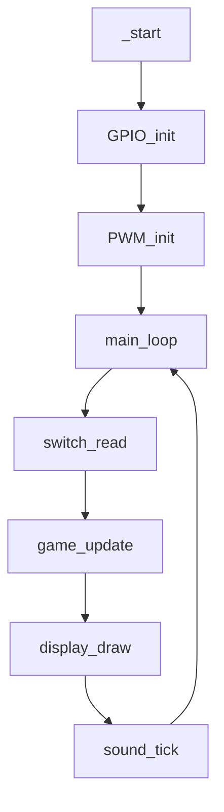

# コール / 実行フロー

Goal: 主要ラベル間の呼び出し順序とループ構造を把握する。

## 典型フロー (擬似)

```text
start -> GPIO_init -> PWM_init -> main_loop
### mermaid 図




main_loop:
  switch_read -> game_update -> display_draw -> sound_tick -> branch back
```

## 割り込み / タイマ

- 現在: 割り込み未使用。System Timer をポーリングし経過時間で BGM / 入力クールタイム等を制御。

## 呼出規約 (Calling Convention)

- 基本: ARM AAPCS 準拠 (r0-r3 引数/戻り値、r4-r11 callee-save)。
- 短小関数は必要最小限 push。長大処理 (描画/スコア計算) は一括保存で整合性優先。
- Stack 8-byte アライン維持。

## 追加検討事項

- 割り込み導入時のベクタ配置フロー案
- タイマ利用パターン (入力 / サウンド) 詳細表
- エラー時フォールバック (無限ループ / LED 点滅案)
